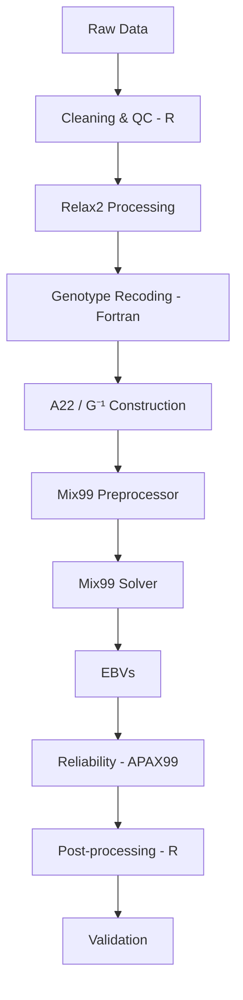

## Mix99

# Genetic Evaluation Pipeline for Methane Emissions


---
## Overview

This repository contains a fully automated pipeline for the estimation of genomic breeding values (GEBVs) and their reliability for methane emissions.

The workflow integrates:
- data preprocessing in R,
- pedigree and genotype processing,
- Fortran-based utilities,
- genetic evaluation using Mix99 under a ssGBLUP framework.

The pipeline is designed to be modular, reproducible, and adaptable to future evaluations.

---
# Workflow Diagram



---

# Repository Structure

```bash
├── data/
├── scripts/
│   ├── preprocessing/
│   ├── mix99/
│   ├── postprocessing/
│   └── validation/
├── fortran/
├── config/
├── results/
├── figures/
└── README.md
```

---
## Pipeline Structure

The workflow consists of the following steps:

### 1. Data Preparation
- Phenotypic data (numeric traits only)
- Pedigree data (ordered and pruned)
- Genotype data (coded as 0, 1, 2, separated by White Spaces)

### 2. Pre-processing
- Renumbering of individuals (Relax2)
- Pedigree pruning
- Recoding of genotype IDs (Fortran)
## Related scripts
- [[`scripts/Relax2/Relax2_1.dir`]](https://github.com/estermt/Mix99-procedure-from-phenotypes-to-EBVs/blob/main/scripts/Relax2/Relax2_1.dir)
- [[`scripts/R/Group allocation in pedigree.R`]](https://github.com/estermt/Mix99-procedure-from-phenotypes-to-EBVs/blob/main/scripts/R/Group%20allocation%20in%20pedigree.R)
- [[`scripts/Fortran/renum_genotypes.f90`]](https://github.com/estermt/Mix99-procedure-from-phenotypes-to-EBVs/blob/main/scripts/Fortran/renum_genotypes.f90)
### 3. Matrix Construction
Generation of:
- A22 matrix,
- G⁻¹ matrix,
- G⁻¹ - A22⁻¹ matrix.
## Related scripts
- [[`scripts/Relax2/Relax2_2_matrizA.dir`]](https://github.com/estermt/Mix99-procedure-from-phenotypes-to-EBVs/blob/main/scripts/Relax2/relax2_2_matrizA.dir)
- [[`scripts/mix99/hginv_param.md`]](https://github.com/estermt/Mix99-procedure-from-phenotypes-to-EBVs/blob/main/scripts/mix99/hginv_param.md)
### Software
- hginv
- Relax2

### 4. Genetic Evaluation (Mix99)
- Preprocessor: `mix99i`
- Estimation of variance components using REML method (mix99s) [[`scripts/mix99ReadME_VC.md`]](https://github.com/estermt/Mix99-procedure-from-phenotypes-to-EBVs/blob/main/scripts/mix99/ReadME_VC.md)
- Solver: `mix99s`

## Related scripts
- [[`scripts/mix99/my_model.clm`]](https://github.com/estermt/Mix99-procedure-from-phenotypes-to-EBVs/blob/main/scripts/mix99/my_model.clm)
- [[`scripts/mix99/ch4_sstp_VC.stop`]](https://github.com/estermt/Mix99-procedure-from-phenotypes-to-EBVs/blob/main/scripts/mix99/ch4_sstp_VC.stop)
- [[`scripts/mix99/ch4_sstp.stop`]](https://github.com/estermt/Mix99-procedure-from-phenotypes-to-EBVs/blob/main/scripts/mix99/ch4_sstp.stop)
### Software
- mix99i
- mix99s
### Configuration files
- [`config/mix99/`](config/mix99/)

---
### 5. Reliability Estimation
- Reliability : apax99
Outputs include:
- reliabilities, using A, G and 7 steps reliability processing
- prediction error variances,
- EBV summaries.
### Related scripts
- [`scripts/postprocessing/`](scripts/postprocessing/)
---
### 6. Post-processing
Post-processing includes:
- extraction of EBVs,
- formatting outputs,
- generation of final datasets,
- summary statistics.

### Related scripts
- [`scripts/postprocessing/`](scripts/postprocessing/)

### Statistics


### 7. Validation (ongoing)
Due to current data limitations, full external validation is not yet implemented. Planned validation includes:
- Correlation with future official evaluations
- Correlations with EBVs from GreenFeed
- Temporal validation using new data
- Distribution and consistency checks of EBVs

---

# Example Outputs

## Reliability Distribution


## Genetic Trend


---

# Reproducibility

## Requirements

- R >= 4.2
- Mix99
- Relax2
- hginv
- APAX99
- GNU Fortran

---


